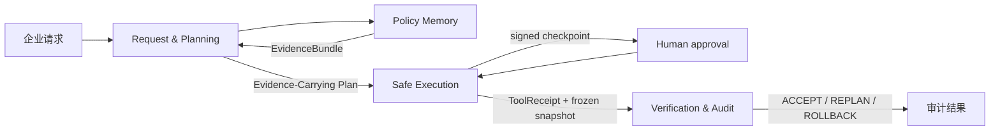

# PolicyFlow

> 企业 Agent 可以获得权限，但每次写入都必须携带证据。

PolicyFlow 是面向 GOAI Agent Infra 赛道的企业流程多 Agent 携证执行控制面。它把已结构化且保留原始文本的业务请求编译为 `policyflow-ecp/v1` Evidence-Carrying Plan：每一步同时声明制度引用、前置条件、所需审批、工具契约、后置条件、补偿和证明义务。当前同一套四 Agent、六 Skill、ToolGateway、检查点与审计链已跑通住宿超标报销和临时生产权限两个流程；权限场景是明确标识、不连接真实 IAM 的本地 deterministic Mock。

## 现场能看到什么

- 四个职责隔离的 Agent：制度记忆、请求与规划、安全执行、验证与审计。
- 精确制度条款、版本和 source hash，而不是无来源回答。
- `ALLOW / REQUIRE_APPROVAL / BLOCK` 策略门和持久化恢复点。
- 服务端最小权限、实际参数重算、幂等冲突检测、签名审批与签名运维操作。
- Executor 不能自证；Verifier 只读冻结快照并给出 `ACCEPT / REPLAN / ROLLBACK`。
- `previous_hash / event_hash` Trace 链，以及带逐文件 SHA-256、CaseLesson 人工评审记录和脱敏 OTel GenAI 语义映射的可校验审计包。
- 候选经验只有经具名 Workflow Operator 签名批准，才能追加到版本化 case-memory 回归数据集；拒绝不入集，也不会自动改写政策或 Skill。
- 21 条 Golden Suite（含 10 条主动攻击）、60 项自动化测试与 6/6 Skill 独立契约评测。
- 两个业务纵切复用同一 ECP：报销现场主 Demo，以及通过 API/评测验证的临时生产权限 Mock。

## 5 分钟运行

要求：Python 3.11+。本地演示不需要模型 API Key，也不会连接真实财务系统。

```powershell
python -m venv .venv
.\.venv\Scripts\Activate.ps1
python -m pip install -e ".[dev]"
.\start_demo.ps1
```

打开 [http://127.0.0.1:8787](http://127.0.0.1:8787)，选择默认“住宿超标，需例外审批”，依次点击经理批准和财务批准。接口文档位于 [http://127.0.0.1:8787/docs](http://127.0.0.1:8787/docs)。

现场 UI 聚焦稳定的报销主流程；临时生产权限通过 `temporary_prod_access` 场景和 Golden Suite 验证，未把报销专用前端冒充为通用控制台。

也可以直接运行验证：

```powershell
python -m pytest
python deploy/agentteams/skill_eval.py
python deploy/agentteams/validate_manifest.py
```

## 架构



AgentTeams 是协作与部署基线；PolicyFlow Runtime 是确定性的企业状态机。MVP 不引入第二套编排框架。完整设计见 [架构说明](docs/ARCHITECTURE.md) 与 [ECP 通用契约](docs/EVIDENCE_CARRYING_PLAN.md)。

## Agent Identity

| Agent | 主要输入 | 主要输出 | 不可越过的边界 |
|---|---|---|---|
| Request & Planning | 结构化请求、保留原文、制度证据 | 归一化请求、ExecutionPlan | 不调用写工具、不批准自己 |
| Policy Memory | 查询、政策版本 | EvidenceBundle、来源指纹 | 不执行写操作、不编造制度 |
| Safe Execution | Plan、审批、工具契约 | ToolReceipt、Checkpoint、RollbackReceipt | 不绕过审批、不验收自己 |
| Verification & Audit | 冻结快照、证据、回执 | VerificationReport、审计包 | 无企业写权限、不修改回执 |

六个可复用 Skill 位于 `skills/`，每个都包含用途、输入输出、调用条件、依赖、失败处理、安全边界、版本/回滚和 `assign_when` 分发元数据；独立质量门把 6 个 Skill 映射到 19 条可重复 Golden 断言。面向评委的官方附录 B 字段汇总见 [核心 Skill 清单](docs/CORE_SKILL_CATALOG.md)。

官方八字段 `Name / Role / Capabilities / Inputs / Outputs / Dependencies / Decision Boundary / Trace` 的逐 Agent 清单见 [Agent Identity](docs/AGENT_IDENTITY.md)。

## AgentTeams v1.2.2

`deploy/agentteams/policyflow-team.yaml` 包含 4 个独立 Worker、1 个 Team 和 2 个不可互代的 Human，使用 `agentteams.io/v1beta1` 与 `Team.spec.workerMembers`。校验脚本从官方 v1.2.2 commit `849182af8e017168a5a200a87b1062142caf462d` 获取 CRD，并完成 schema 与语义检查。

2026-08-16 已在 AgentTeams v1.2.2 本地 Docker 测试集群完成真实 `agt apply`：4 Worker `Running`、1 Team `Active (3/3)`、2 Human `Active`。Matrix 观察到 Planner→Policy→Planner、Planner→Executor→Planner、Planner→Verifier→Planner 共 6 段 Agent→Agent 交接，并由 Planner 生成最终回执；所有 canonical event 都携带同一 PolicyFlow `run_id / trace_id`。这次 live dry-run 在 AgentTeams 共享存储缺少受控制度包时真实 fail-closed：Policy 拒绝编造，Executor 未调用企业写工具并坚持双人审批，Verifier 返回 `REPLAN`。完整脱敏事件 ID、消息体 SHA-256、镜像 digest 与边界见 [AgentTeams live receipt](docs/evidence/agentteams-live-v0.3.1/receipt.json)。

本地 FastAPI Demo 仍是确定性控制面，不冒充由 Matrix 实时驱动；本次仅把相同关联 ID 注入 live Matrix 任务，尚未打通 SQLite/MCP 状态桥，也未声称 6 个自研 Skill 已由 Manager 分发或热加载。详情见 [AgentTeams 证据说明](docs/AGENTTEAMS_EVIDENCE.md)。官方项目：[AgentTeams](https://github.com/agentscope-ai/AgentTeams)，[v1.2.2 Release](https://github.com/agentscope-ai/AgentTeams/releases/tag/v1.2.2)。

## 安全模型

- 审批身份由服务端签名并绑定单次 Run、Plan、Checkpoint、具体 approve/reject 决策与批准参数 hash；客户端不能提交角色字符串冒充审批人，也不能把批准凭证改作拒绝。
- 执行前根据实际工具参数重新构造 approved action 并计算 hash，不能沿用旧 hash 替换金额、单据或制度引用。
- 同一幂等键只有在工具和参数 hash 相同才返回旧回执；不一致直接拒绝。
- 人工 rollback/resume 也需要签名 Workflow Operator 身份并产生 Trace。
- CaseLesson 评审 Token 同时绑定 lesson、approve/reject 决策、候选 hash、政策版本和数据集基准/目标版本；成功使用后不可重放。
- Trace hash 链和审计 Manifest 是 tamper-evident，不是数字签名或不可抵赖证明。
- 本地身份目录是明确标识的 Demo 模式；生产必须替换为 AgentTeams/Higress 或企业 SSO。

完整威胁模型与限制见 [安全说明](docs/SECURITY.md)。

## 评测证据

```text
pytest:             60 passed
Golden Suite v3:   21 / 21 passed
Attack blocking:   10 / 10 passed
Skill contract eval: 6 / 6 skills; 19 / 19 associations
Browser QA (manual): 320 / 375 / 414 / 768 / 1440 px
AgentTeams static: 7 / 7 CRD resources; 6 / 6 Skill package metadata
AgentTeams live:   4 Workers Running; Team Active 3/3; 2 Humans Active; 6 handoffs observed
```

测试覆盖签名伪造、跨 Run 重放、错误角色、空角色/伪造审批对象、实际参数替换、非 Executor 写调用、提示注入、硬上限、并发幂等、重启恢复、Trace/ZIP 篡改和脱敏；还覆盖 CaseLesson 决策替换、跨 Run 复用、单次使用、数据集版本过期、拒绝隔离与重启持久化。所有测试使用临时 SQLite，不污染演示数据。

OpenTelemetry 输出是基于现有 Trace 的脱敏 GenAI 语义映射，不是 OTLP envelope，也未声称已接入 Collector 或 AgentScope Studio。方法与边界见 [OTel GenAI 映射](docs/OTEL_GENAI_MAPPING.md)。2026-08-15 的最终隔离复跑命令、结果与一条完整 Run 摘录见 [初赛最终运行回执](docs/FINAL_EVIDENCE_RECEIPT.md)。

## 项目结构

```text
src/policyflow/          状态机、Agent、工具网关、API/MCP、评测
web/                     无构建步骤的现场控制台
data/                    独立编写的两套政策与演示场景
skills/                  6 个完整 Skill 契约
deploy/agentteams/       v1.2.2 清单、权限说明、官方 CRD 校验
tests/                   攻防与可靠性测试
docs/                    架构、安全、GOAI 映射、演示与评委复核
```

## GOAI 对齐与参赛说明

官方要求、逐项证据和仍待补项见 [GOAI 合规矩阵](docs/GOAI_COMPLIANCE.md)，推荐工具的采用/替代与迁移依据见 [工具链决策](docs/TOOLCHAIN_DECISIONS.md)，CaseLesson 的人工治理闭环见 [Case Memory 治理契约](docs/CASE_MEMORY_GOVERNANCE.md)，90 秒现场流程见 [演示脚本](docs/DEMO_SCRIPT.md)。第三方依赖、数据和未实现边界见 [第三方与开源披露](docs/THIRD_PARTY_NOTICES.md)。项目借鉴既有比赛中验证过的通用工程方法，但所有领域数据、接口、规则、测试与实现均独立重写，见 [clean-room 说明](docs/CLEAN_ROOM.md)。

本项目采用 Apache License 2.0。公开仓库：[oald-gali/PolicyFlow-AgentTeams](https://github.com/oald-gali/PolicyFlow-AgentTeams)；固定版本：[v0.3.1](https://github.com/oald-gali/PolicyFlow-AgentTeams/releases/tag/v0.3.1)。
