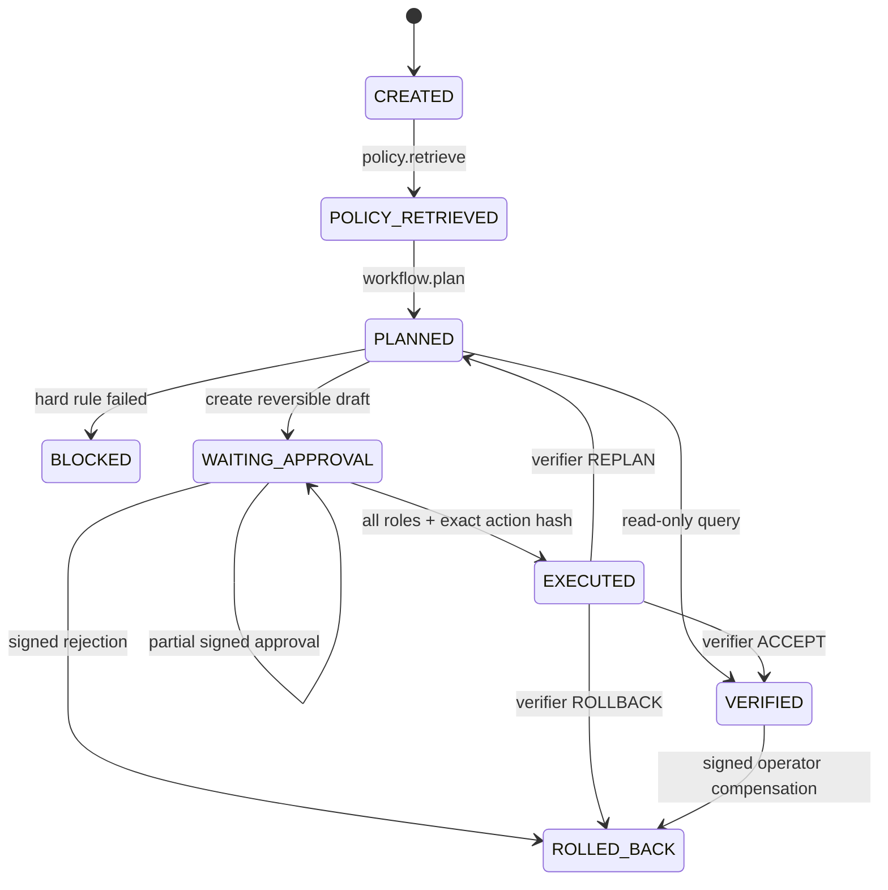

# PolicyFlow 架构说明

## 设计决策

PolicyFlow 把“Agent 的认知分工”和“企业流程的确定性控制”分开：AgentTeams 负责身份、协作、Skill 分发、MCP 网关和人机可见性；PolicyFlow Runtime 负责可恢复状态、策略门、审批绑定、幂等副作用与独立验收。这样既保留多 Agent 的专业分工，也不让模型自由决定财务硬规则。

## 端到端状态机



每次状态转换先生成结构化 Trace，再写入 SQLite checkpoint。最后一位审批在任何企业写操作前单独持久化；若进程恰在此后退出，签名 Workflow Operator 可从同一 checkpoint 调用 resume，服务端仍会重新验证全部审批和参数快照。

## 四个 Agent 的上下文交接

1. Policy Memory 冻结政策 `policy_id/version/source_hash`，返回带 clause 和 quote 的 EvidenceBundle。
2. Planner 保留原文并产生 ExecutionPlan；每个步骤声明 Agent、工具、副作用、审批和补偿。
3. Executor 只接受白名单工具，并在 ToolGateway 内验证 Agent 身份、schema、approved action、幂等键和权限。
4. Verifier 接收 Run 的 deep-copy 冻结快照；它没有写工具，只能裁决 ACCEPT、REPLAN 或 ROLLBACK。

## approved action 规范对象

审批和执行前都使用同一投影：

```json
{
  "run_id": "...",
  "plan_id": "...",
  "tool_name": "expense.submit",
  "expense_id": "...",
  "amount": "1960.00",
  "cost_center": "CC-GOAI-26",
  "destination": "杭州",
  "policy_refs": ["ev_..."]
}
```

Checkpoint 绑定该对象的 canonical JSON SHA-256。ToolGateway 不信任调用者附带的 hash，而是从实际执行参数重新构造投影并对比持久化快照。

## Trace 与审计

每个事件保存 `trace_id/span_id/parent_span_id/agent_id/state_before/state_after/evidence_ids/tool_name/arguments_hash/idempotency_key/decision/latency`，以及 `previous_hash/event_hash`。审计 ZIP 包含脱敏 `run.json`、`trace.jsonl`、报告、政策快照、`case-lesson.json`、`trace-otel-genai.json` 和 Manifest；Manifest 保存逐文件 SHA-256 与链头。未评审 CaseLesson 只作为候选；具名 Workflow Operator 以绑定 lesson、决策、候选 hash、政策版本和数据集版本的 HMAC Token 作出一次性决定。批准后仅追加到 `policyflow-case-memory/v1` 回归数据集，拒绝不入集；两种结果都不会自动改写政策、Skill 或测试文件。已批准 lesson 的审计包额外带有受 Manifest 保护的 `case-memory-dataset.json`。完整契约见 `docs/CASE_MEMORY_GOVERNANCE.md`。

`trace-otel-genai.json` 把 Workflow、Agent、检索、规划和工具事件映射到 OpenTelemetry GenAI 的 `invoke_workflow / invoke_agent / retrieval / plan / execute_tool` 操作名。它只携带状态、工具名与 hash 等最小字段，不导出原始请求、工具实参或审批 Token；当前是 mapping-only，不是 OTLP envelope，也没有声称已接入 Collector 或 AgentScope Studio。

这提供可检测篡改的完整性证据，但没有外部密钥签名，因此不宣称不可抵赖。生产可将链头写入 WORM 存储、数据库审计日志或签名服务。

## 部署边界

Local Demo 使用 FastAPI、SQLite 和模拟工具适配器，完全离线可跑。AgentTeams 部署清单使用四个 Worker、一个 Team、两个不可互相替代的 Human（Department Manager 与 Finance Reviewer）及受限 MCP consumer。企业 `expense.*` 动作不直接暴露给任意 MCP 调用者；外部 MCP 是编排门面，真实凭据与副作用留在服务端 ToolGateway/Higress 边界。四个 MCP 门面工具发布 output schema 与只读、破坏性、幂等、开放世界提示，但这些提示只用于发现，最终授权仍由 ToolGateway 执行。该清单已通过固定 v1.2.2 CRD 静态校验，并在本地测试集群完成 4 Worker Running、Team Active、2 Human Active 与 6 段 Matrix Agent→Agent 交接；六个 Skill 仍只完成 package metadata 静态检查，尚未验证 Manager→Worker 包分发/热加载。Local Demo 与 Matrix live dry-run 通过 `run_id / trace_id` 对齐，但未接通实时状态桥。
