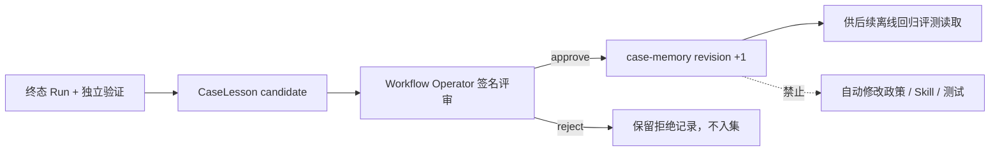

# Case Memory 人工治理契约

## 结论

PolicyFlow 的“持续进化”不是让 Agent 自动改规则，而是一个可复核的离线闭环：每个终态 Run 生成不可变 CaseLesson 候选；只有具名 `Workflow Operator` 使用服务端 HMAC 签名、作出最终 `approve` 决策后，候选才会以新 revision 追加到 `policyflow-case-memory/v1` 回归数据集。`reject` 会保留具名审计记录，但绝不进入数据集。任何决定都不会自动修改政策文件、Skill 或测试代码。

## 状态与数据流



只有 `BLOCKED`、`ROLLED_BACK` 或 `VERIFIED` 且已有独立 `VerificationReport` 的 Run 可进入评审。运行中、等待审批或缺少独立验证的 Run 会被拒绝。

## 签名绑定与防错用

评审凭证复用 `ApprovalTokenService` 的 HMAC 机制，并绑定以下规范对象的 SHA-256：

```json
{
  "lesson_id": "lesson_...",
  "decision": "approve | reject",
  "candidate_format": "policyflow-case-lesson/v1",
  "candidate_hash": "sha256(canonical candidate)",
  "policy_version": "...",
  "dataset_schema_version": "policyflow-case-memory/v1",
  "base_revision": 0,
  "target_revision": 1,
  "review_contract_id": "lesson-review-contract_..."
}
```

- 决策绑定：`approve` Token 不能改作 `reject`，反之亦然。
- 对象绑定：Token 不能跨 Run 或跨 lesson 使用；候选或政策版本变化后旧 Token 无效。
- 版本绑定：批准前若其他候选已推进数据集 revision，旧 Token 无效，必须重新签发。
- 单次使用：`lesson_id` 是评审表主键，Token 指纹也唯一；同一 lesson 只能有一个最终人工决定。
- 原子落库：评审记录、批准后的数据集条目和 Run Trace 在同一 SQLite 事务提交；拒绝事务不创建数据集条目。

Token 原文不会写入 Run、Trace、审计包或数据集；只持久化 SHA-256 指纹用于重放检测。HMAC 是本地 Demo 身份，不等同于企业 SSO 或不可抵赖数字签名。

## HTTP 接口

| 方法 | 路径 | 作用 |
|---|---|---|
| GET | `/api/runs/{run_id}/case-lesson` | 读取候选或最终人工评审状态 |
| POST | `/api/runs/{run_id}/case-lesson/review-session` | 为 Workflow Operator 签发绑定 lesson/decision/revision 的 Demo Token |
| POST | `/api/runs/{run_id}/case-lesson/reviews` | 提交一次最终 `approve` 或 `reject` 决策 |
| GET | `/api/case-memory` | 读取当前 schema、revision、治理不变量和已批准条目 |

签发请求：

```json
{"reviewer_id":"operator-wu","decision":"approve"}
```

最终评审请求：

```json
{
  "decision":"approve",
  "review_token":"<server-issued token>",
  "reason":"已复核制度证据、结果与回归断言。"
}
```

生产部署必须关闭 Demo 评审签发能力，改由 AgentTeams/Higress 或企业 SSO 提供可信身份与短期授权。

## 持久化与审计证据

- `case_lesson_reviews` 保存最终决策、具名人员、角色、理由、候选 hash、绑定 hash、Token 指纹和版本信息。
- `case_memory_entries` 只保存批准项，以单调递增 `dataset_revision` 排序。
- Run Trace 新增 `case_lesson.approve` 或 `case_lesson.reject`，记录决策与绑定 hash，不记录 Token。
- `case-lesson.json` 在评审后包含具名决定及明确的 `automatic_policy_or_skill_mutation=false`。
- 批准项的 audit ZIP 额外包含 `case-memory-dataset.json`；拒绝项没有该文件。所有导出文件仍由 `MANIFEST.json` 的逐文件 SHA-256 覆盖。

## 可验证不变量

`tests/test_case_memory_governance.py` 覆盖九项：候选不自动入集与错误角色拒绝、具名批准、具名拒绝隔离、决策替换、跨 Run 使用、Token 重放、数据集版本过期、重启持久化/API 接线，以及非终态拒绝。连同 AgentTeams handoff 契约测试，当前全量 `pytest` 为 60/60。

## 明确边界

- 这是版本化回归数据集，不是在线模型训练或自动自修改 Agent。
- 数据集当前只持久化在单机 SQLite；不是外部 WORM、分布式数据库或签名账本。
- 当前没有自动把条目写入 `data/scenarios.json`、`tests/`、政策文件或任何 `SKILL.md`；后续只能由维护者在代码审查中显式消费批准条目。
- 本闭环在 PolicyFlow Local Runtime 内验证；不声称已由 AgentTeams Matrix 实时运行。
